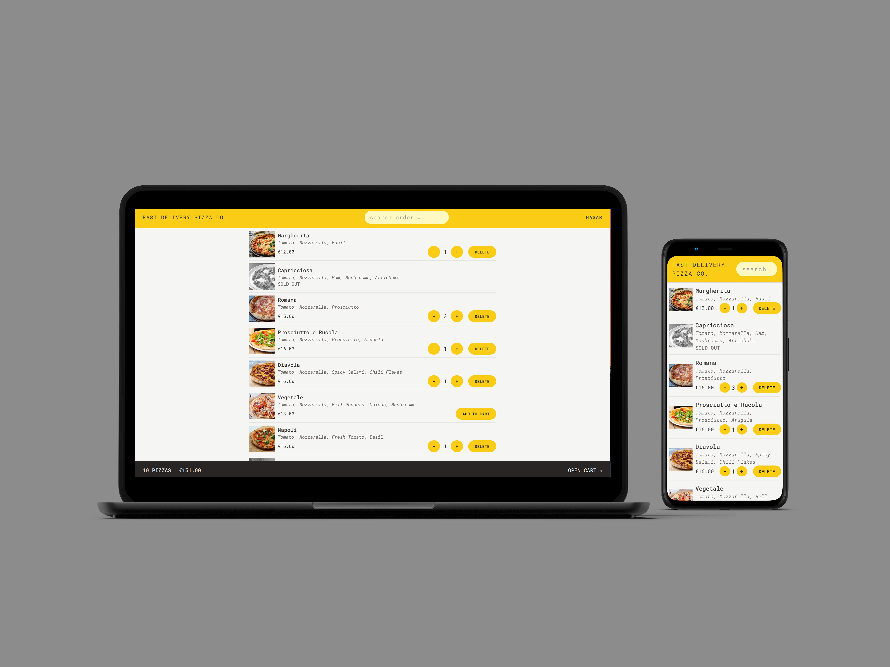

### **Fast Delivery Pizza Co: A Streamlined Pizza Ordering App**

## **Table of content:**

- [Description](#description)
- [Key Features](#key-features)
- [Project Structure](#project-structure)
- [Technical Highlights](#technical-highlights)
- [Conclusion](#conclusion)

**Live demo** [click here](https://far-away-packing-list-app.netlify.app/)



---

### **Description:**

Fast Delivery Pizza Co is a user-friendly React-based application that allows users to order pizzas quickly and effortlessly. Designed for simplicity and speed, the app provides a seamless experience for browsing a dynamic menu, adding pizzas to a cart, and placing orders without requiring user accounts or logins. It also incorporates additional features like GPS location support and priority ordering to enhance the user experience.

---

### **Key Features:**

1. **Dynamic Pizza Menu:**

   - The menu is loaded dynamically from an API, allowing for easy updates.

2. **Simple Ordering Process:**

   - No user accounts or logins are required. Users simply input their names to start.
   - Users can add multiple pizzas to their cart before placing an order.

3. **Flexible User Data Input:**

   - At the time of ordering, users provide their name, phone number, address, and optionally, their GPS location for easier delivery.

4. **Priority Ordering:**

   - Users can mark orders as “priority” for an additional 20% fee during or after the order placement.

5. **Order Management:**

   - Orders are sent via a **POST request** with user and order data to the API.
   - Each order receives a unique ID, allowing users to look it up later.

6. **No Payment Integration:**
   - Payments are handled on delivery, simplifying the app’s implementation.

---

### **Project Structure:**

```
- index.html
- public
- README.md
- src
  ├── App.jsx                # Main application component
  ├── features
  │   ├── cart               # Cart management
  │   │   ├── Cart.jsx
  │   │   ├── CartItem.jsx
  │   │   ├── CartOverview.jsx
  │   │   ├── cartSlice.js
  │   │   ├── DeleteItem.jsx
  │   │   ├── EmptyCart.jsx
  │   │   ├── ItemQuantity.jsx
  │   ├── menu               # Pizza menu components
  │   │   ├── Menu.jsx
  │   │   ├── MenuItem.jsx
  │   ├── order              # Order-related components
  │   │   ├── CreateOrder.jsx
  │   │   ├── Order.jsx
  │   │   ├── OrderItem.jsx
  │   │   ├── SearchOrder.jsx
  │   │   ├── UpdateOrder.jsx
  │   ├── user               # User management
  │   │   ├── CreateUser.jsx
  │   │   ├── Username.jsx
  │   │   ├── userSlice.js
  ├── index.css              # Global styling
  ├── main.jsx               # Entry point for the app
  ├── services               # API and geocoding services
  │   ├── apiGeocoding.js
  │   ├── apiRestaurant.js
  ├── store.js               # Redux store configuration
  ├── ui                     # UI components
  │   ├── AppLayout.jsx
  │   ├── Button.jsx
  │   ├── Error.jsx
  │   ├── Header.jsx
  │   ├── Home.jsx
  │   ├── LinkButton.jsx
  │   ├── Loader.jsx
  ├── utils                  # Helper functions
  │   ├── helpers.js
```

---

### **Technologies Used:**

- **React.js:** Component-based front-end framework for building UI.
- **Redux:** State management for cart and user information.
- **React Router:** Enables seamless navigation between pages and views.
- **Tailwind CSS:** Utility-first CSS framework for responsive and clean UI design.

---

### **Conclusion:**

Fast Delivery Pizza Co combines React, Redux, and Tailwind CSS to create an efficient and modern pizza ordering experience. Its flexibility with API-driven menus, priority ordering, and streamlined user flow makes it a practical and professional-grade application that demonstrates strong technical and design skills.
